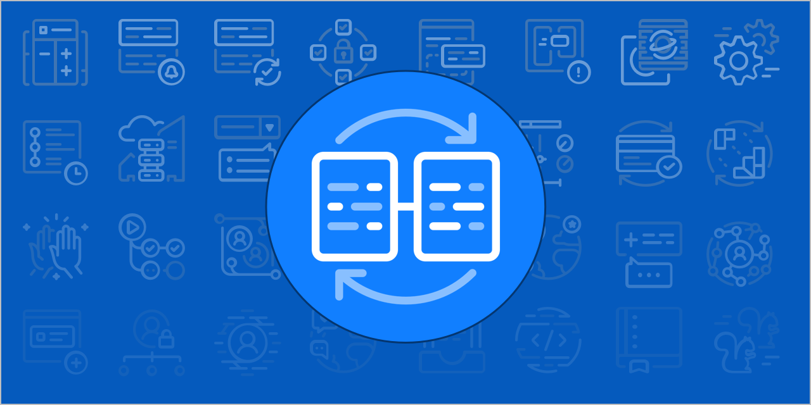

# Migrate to GitHub

GitHub is where people build software. Canarys provides a full support on GitHub services from idea to implementation. Our experts are ready to help you on consulting, deployment, migration, integration and more.

We deliver the guidance and insight for you to have a successful migration, retaining full version control history and metadata, such as Issues, Pull Requests, Comments, and Users. Ensure the data is migrated to your GitHub Enterprise Cloud account accurately and efficiently, with guidance and best practice expertise from our Implementation Engineer.

## Target Audience

- GitHub Enterprise Cloud Admins
- DevOps Engineers

## Key Features and Benefits

- Demonstrate GitHub Enterprise migration utility functionality and usage
- Assist in source (TFVC, Azure DevOps, SVN, Bitbucket, GitLab and many other platforms) to GitHub Enterprise destination migration during allotted timeframe
- Guide mapping source users to GitHub Enterprise Cloud destination users for authorship traceability
Support you in applying source archive bundles onto GitHub Enterprise Cloud destination

## Delivery Methods

- Remote
- Onsite

## Syllabus

In this engagement, a Implementation Engineer will guide you through the process of migrating sources to the GitHub Enterprise Cloud target. This includes:
- Analyse the current environment and define the migration strategy
- Export sources
- Review essential best practices for users, groups, projects, and repositories
- Map sources to GitHub Enterprise Cloud, such as organizations, users, teams, and repositories
- Conduct migration dry-runs
- Write and distribute migration docs

## Businesss Outcomes

After this engagement, your team will be able to:
- Complete migration dry runs
- Support production migrations
- Maintain Git history and source metadata
- Minimize down time